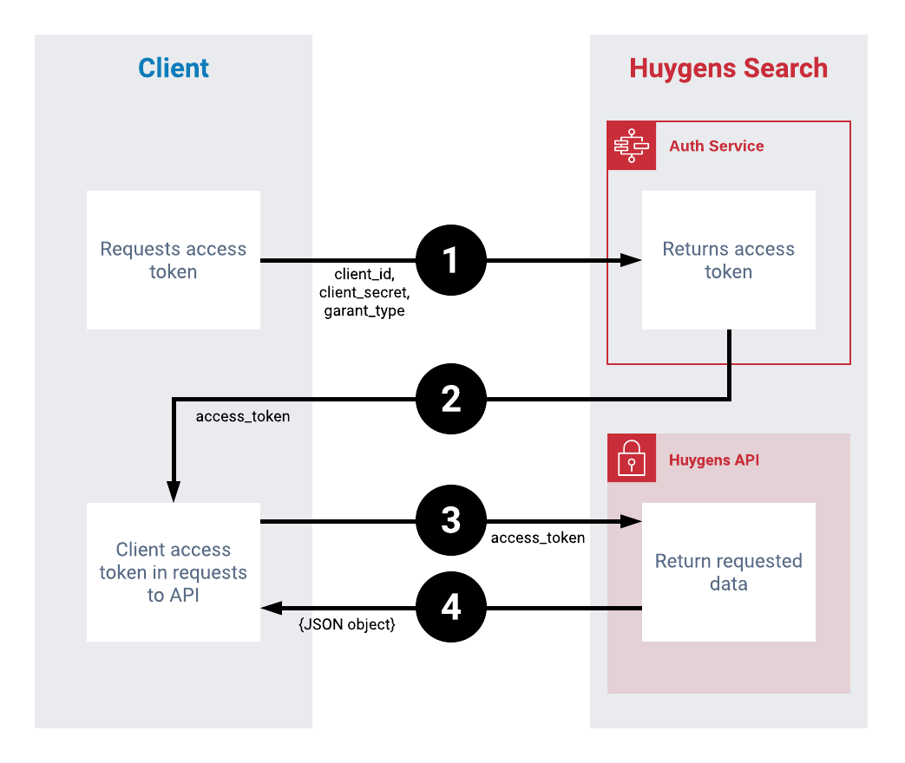

# Authorization Guide

## Client Credentials Flow

The Client Credentials flow is used in server-to-server authentication. 

This flow makes it possible to authenticate your requests to the Huygens Search API. For further information about this flow, see _Client Credentials Grant_ definition in [RFC-6749, section 4.4.](https://tools.ietf.org/html/rfc6749#section-4.4)


Before performing this flow you must register your application using the [Client Sing Up endpoint](../endpoint-reference/sign-in.md). This endpoint generate a client id and secret key useful in this flow.  


